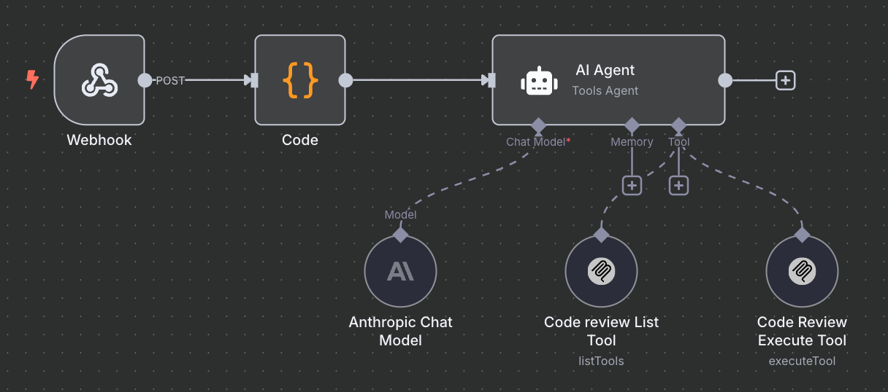

# How to Trigger This Project's MCP Tool via n8n from CI

This document explains how to use your CI pipeline to trigger an n8n webhook, which in turn calls the MCP tool (such as code review) provided by this project.

## 1. Overview

- **Goal:** Let your CI (e.g., GitHub Actions, GitLab CI) trigger an n8n workflow, which then calls the MCP tool (e.g., code review) from this project.
- **n8n MCP Node:** Used only as a bridge to connect n8n with the MCP tool. See [n8n-nodes-mcp](https://www.npmjs.com/package/n8n-nodes-mcp) for details.

## 2. Set Up n8n Workflow

The following diagram illustrates a recommended n8n workflow for triggering this project's MCP tool from CI:



**Workflow Steps:**

1. **Webhook Node**: Receives the HTTP POST request from your CI pipeline. This is the entry point for the automation.
2. **Code Node**: Processes the incoming payload (e.g., extracts the GitHub URL or other parameters) and prepares the data for the AI Agent.
3. **AI Agent (Tools Agent) Node**: Orchestrates the workflow. It can:
   - Use the **Anthropic Chat Model** for natural language understanding or summarization.
   - Call the **Code review List Tool** to list available code review tools or options.
   - Call the **Code Review Execute Tool** to actually perform the code review using this project's MCP tool.

**Key Points:**

- The n8n MCP node ([n8n-nodes-mcp](https://www.npmjs.com/package/n8n-nodes-mcp)) is used to connect n8n with the MCP tool provided by this project.
- The AI Agent node can flexibly combine multiple tools and models, making it easy to extend or customize the workflow.

**Example:**
When your CI pipeline sends a POST request to the webhook with `{ "githubUrl": "url" }`, the workflow will process the request, invoke the code review MCP tool, and return the results or trigger further actions as configured.

## 3. Templates and Setup

You can find the following templates in the `doc/templates` directory:

- [n8n workflow template](./templates/n8n_template.json)
- [Docker Compose template](./templates/docker-compose.yml)

### Docker Compose Setup

1. Before running the Docker Compose file, make sure to:
   - Set your Ngrok authentication token in the `NGROK_AUTHTOKEN` environment variable
   - Configure the `N8N_HOST` and `N8N_PROTOCOL` environment variables if needed

### n8n Node Setup

1. Import the n8n workflow template (`n8n_template.json`) into your n8n instance
2. Configure the following credentials:
   - Anthropic API key for the Anthropic Chat Model node
   - MCP Client API credentials for both Code Review List Tool and Code Review Execute Tool nodes

For advanced integration, please refer to the above resources or contact the project maintainer.

## 4. Trigger n8n Webhook from CI

In your CI (e.g., GitHub Actions, GitLab CI, Jenkins, etc.), call the n8n webhook at the appropriate step. For example:

```yaml
# Example for GitHub Actions
jobs:
  code-review:
    runs-on: ubuntu-latest
    steps:
      - name: Checkout code
        uses: actions/checkout@v3
      - name: Trigger n8n Webhook
        run: |
          curl -X POST \
            -H "Content-Type: application/json" \
            -d '{"githubUrl: url"}' \
            https://your-n8n-domain/webhook/code-review
```

## 5. References

- [n8n-nodes-mcp package documentation](https://www.npmjs.com/package/n8n-nodes-mcp)
- [n8n official documentation](https://docs.n8n.io/)
- [MCP Protocol documentation](https://modelcontextprotocol.org/)
- This project's README for MCP tool details
